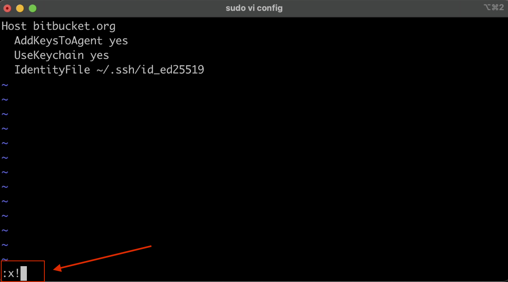

# How to Create and Add SSH Key

Step 1:

Step 2:

Step 3:

Step 4:

Step 5:

Step 6:

Step 7:

Step 8:

Step 9:

Step 10:

Step 11:

Step 12:

Step 13:

Step 14:

Step 15:

Step 16:

Step 17:

Step 18:

Step 19:

Step 20:

Step 21:

Step 22:

Step 23:

Step 24:

